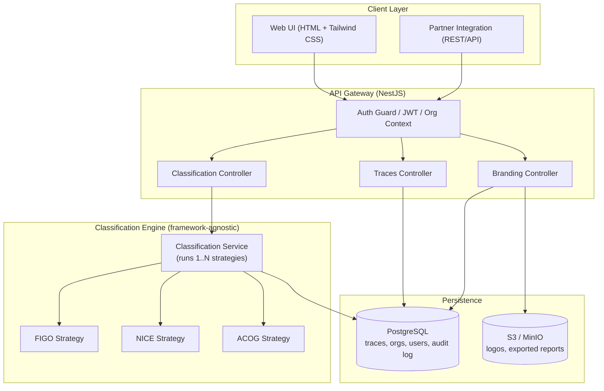
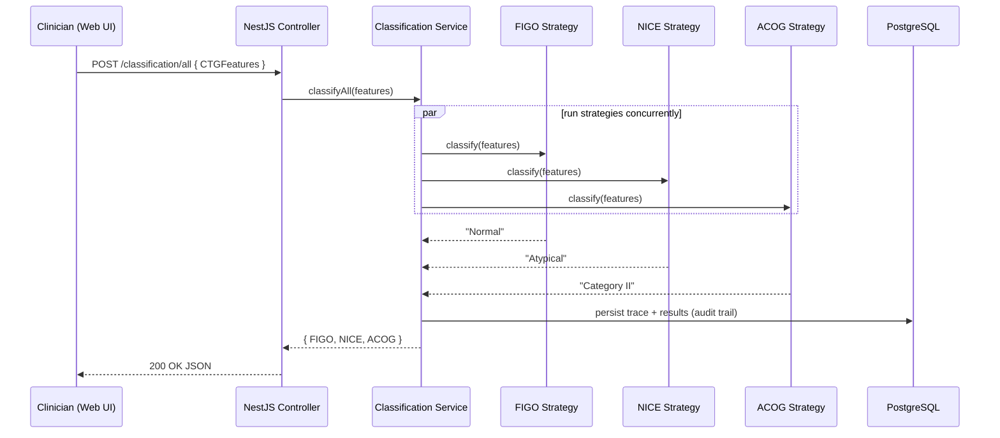
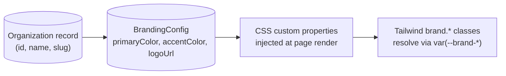
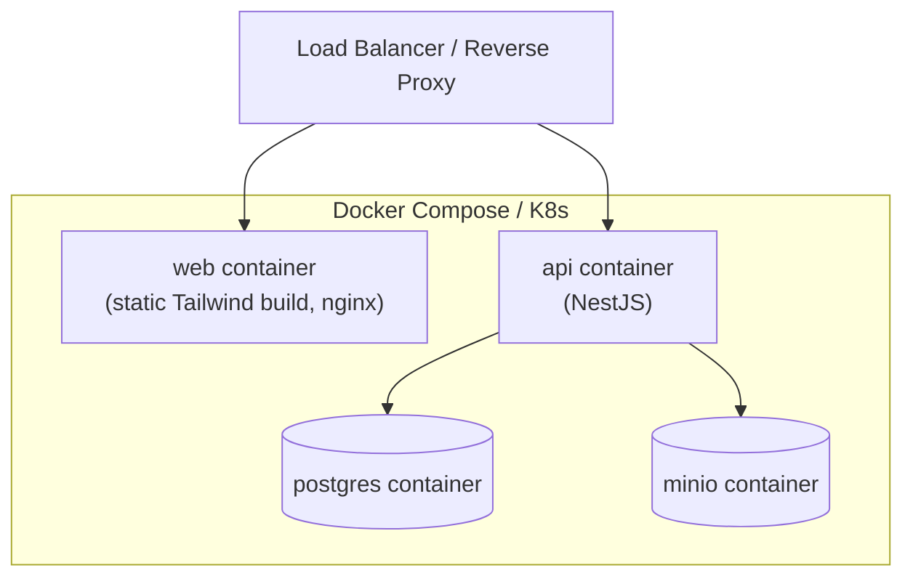

# Architecture Overview — CTG - Early Warning System

## 1. Goals driving the architecture

1. **Multi-guideline by design** — FIGO/NICE/ACOG (and future guidelines) must be independently addable/removable without touching unrelated code.
2. **White-label / multi-tenant** — one deployment can serve several hospitals or device-vendor partners, each with their own logo + colors, without forking the codebase.
3. **API-first** — the web UI is one consumer of the classification API; a partner's own device software or mobile app should be able to call the same endpoint.
4. **Portable clinical logic** — the actual rule engine must be usable outside the web framework (tests, CLI batch scoring, future mobile/embedded reuse).

## 2. High-level system diagram



## 3. Request flow — "classify against all guidelines"



## 4. Classification engine — strategy pattern

The web platform this becomes an explicit **strategy pattern**, so each guideline is independently testable, versionable, and hot-swappable:

```typescript
// packages/core/src/types/CTGFeatures.ts
export interface CTGFeatures {
  baseline: number;
  variability: number;
  accelerationCount: number;
  lateDecelCount: number;
  earlyDecelCount: number;
  variableDecelCount: number;
  prolongedDecelCount: number;
  totalDecelCount: number;
  repetitiveVariable: boolean;
  contractionsPer10Min: number;
}

// packages/core/src/guideline-strategy.interface.ts
export interface GuidelineStrategy {
  readonly id: "FIGO" | "NICE" | "ACOG";
  classify(features: CTGFeatures): string;
}
```

```typescript
// packages/core/src/figo.ts
import {CTGFeatures} from "./types/CTGFeatures";
import {GuidelineStrategy} from "./guideline-strategy.interface";

export const FigoStrategy: GuidelineStrategy = {
  id: "FIGO",
  classify(f: CTGFeatures): string {
    const abnormalBaseline = f.baseline < 100 || f.baseline > 180;
    const abnormalVariability = f.variability < 5 || f.variability > 25;
    const hasSevereDecels = f.lateDecelCount > 0 || f.prolongedDecelCount > 0;

    if (
      abnormalBaseline &&
      abnormalVariability &&
      hasSevereDecels &&
      f.accelerationCount === 0 &&
      hasSevereDecels &&
      (f.lateDecelCount >= 3 ||
        f.prolongedDecelCount >= 3 ||
        f.repetitiveVariable)
    )
      return "Pathological";

    const borderlineBaseline =
      (f.baseline >= 100 && f.baseline <= 109) ||
      (f.baseline > 160 && f.baseline <= 180);

    if (
      borderlineBaseline &&
      abnormalVariability &&
      f.accelerationCount <= 1 &&
      ((f.lateDecelCount >= 1 && f.lateDecelCount <= 2) ||
        (f.prolongedDecelCount >= 1 && f.prolongedDecelCount <= 2))
    )
      return "Suspicious";

    return "Normal";
  },
};
```

The service layer simply iterates over a registered list of strategies:

```typescript
// apps/api/src/modules/classification/classification.service.ts
@Injectable()
export class ClassificationService {
  private readonly strategies: GuidelineStrategy[] = [
    FigoStrategy,
    NiceStrategy,
    AcogStrategy,
  ];

  classifyAll(features: CTGFeatures): Record<string, string> {
    return Object.fromEntries(
      this.strategies.map((s) => [s.id, s.classify(features)]),
    );
  }

  classifyOne(id: string, features: CTGFeatures): string {
    const strategy = this.strategies.find((s) => s.id === id);
    if (!strategy) throw new NotFoundException(`Unknown guideline: ${id}`);
    return strategy.classify(features);
  }
}
```

**Adding a new guideline** (e.g. a national variant) is then: implement `GuidelineStrategy`, register it in the array (or auto-discover via Nest's DI token multi-provider pattern), add UI copy — no changes anywhere else.

> **Note on the source logic:** the original Java conditions for FIGO/NICE/ACOG had a few internal inconsistencies worth resolving during the port — e.g. in `classifyNICE`, `f.baseline < 100 || f.baseline > 180` binds looser than intended due to Java operator precedence (`&&` binds tighter than `||`), so it evaluates as `f.baseline < 100 || (f.baseline > 180 && ...)` rather than the probably-intended `(f.baseline < 100 || f.baseline > 180) && ...`. Flag this to your clinical reviewer before porting the rules verbatim — the TypeScript port should use explicit parentheses either way to avoid the ambiguity.

## 5. Multi-tenant branding



- Each `Organization` (hospital, clinic, or device-vendor partner) owns one `BrandingConfig` row: primary color, accent color, logo asset URL, optional custom domain.
- On page load, the web app fetches the org's branding config and sets CSS custom properties (`--brand-primary`, `--brand-accent`) on `:root`; Tailwind's `brand.primary` / `brand.accent` utility classes reference those variables, so **no rebuild is needed per tenant** — one compiled CSS bundle serves everyone.
- Logo assets are stored in S3/MinIO under `orgs/{orgId}/logo.png` and served via signed/public URL depending on deployment.
- Default fallback theme = Navy `#00296B` / Signal Yellow `#FFD500` (see README brand table).

## 6. Deployment view



For hospital on-prem deployments, the same `docker-compose.yml` runs air-gapped; for SaaS/multi-tenant hosting, swap Postgres/MinIO for managed equivalents (RDS, S3) and put both containers behind the same load balancer/ingress.

## 7. Cross-cutting concerns

| Concern                 | Approach                                                                                                                                                                                |
| ----------------------- | --------------------------------------------------------------------------------------------------------------------------------------------------------------------------------------- |
| **Audit trail**         | Every classification call is persisted with input features, per-guideline result, timestamp, and requesting user/org — required for clinical traceability and later validation studies. |
| **Versioning of rules** | Each strategy exposes a `version` field; stored alongside results so historical classifications remain reproducible even after a rule update.                                           |
| **Validation**          | Input DTOs validated with `class-validator` (Nest) before reaching the engine — reject out-of-range physiological values early.                                                         |
| **Observability**       | Structured logging (pino), request tracing, and a `/health` endpoint for orchestration probes.                                                                                          |
| **Extensibility**       | New guideline = new strategy file + registration; new partner = new org + branding config row — no code fork required.                                                                  |
